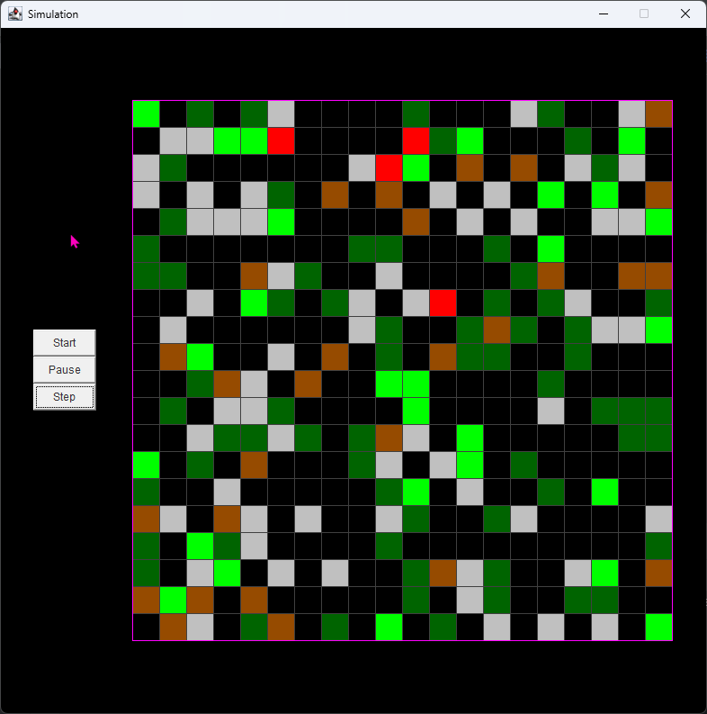

## simulation

### Preview

### About
В этом проекте реализовано задание проекта симуляция из курса проектов https://zhukovsd.github.io/java-backend-learning-course/Projects/Simulation/  
Структура файлов проекта и архитектуру приложения я постарался реализовывать в соответствии с заданием

### GUI
Для реалзации графического интерфейса используется библиотека Swing.
